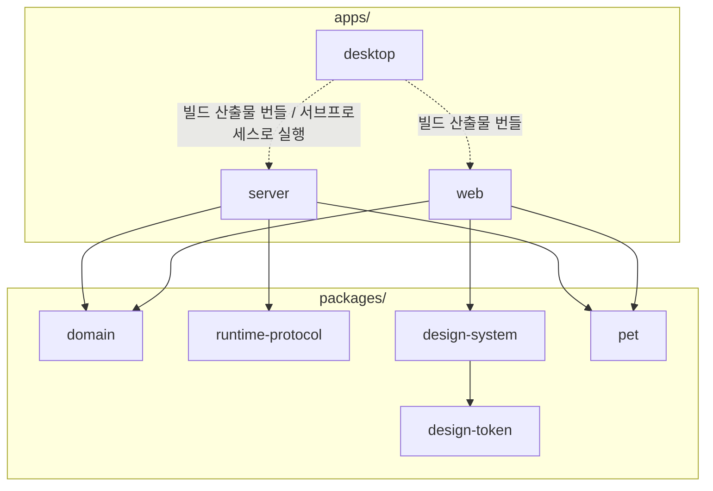

# AI Pixel Office

귀여운 반려동물 모습의 AI 동료를 만들고 작업을 맡기는 로컬 우선 데스크톱 앱입니다. Codex와 Claude Code를 실행 엔진으로 사용하며, 실제 작업 상태와 진행 이벤트를 픽셀 오피스와 작업 상세 화면에 표시합니다.

## 기술 구성

- Desktop: Electron, electron-builder
- Web renderer: Vite, React, TypeScript, styled-components, TanStack Query, PixiJS(네이티브 Dialog/Popover, Radix 미사용)
- API: Fastify, Server-Sent Events
- DB: Node SQLite (WAL)
- Runtime: Codex App Server, Claude Code CLI stream-json

## 코드 구조

pnpm workspace는 실행 앱과 공유 계약을 분리합니다.

```text
apps/
├─ desktop/          Electron main/preload와 installer 설정
├─ server/           로컬 API·SQLite·runtime orchestration
└─ web/              React renderer와 Pixel Office
packages/
├─ domain/           제품 entity·validation·task state
├─ runtime-protocol/ Claude/Codex 정규화 event 계약
├─ design-token/     색상·spacing·shadow·typography·animation 등 원시 design token
├─ design-system/    Button/IconButton/Field/Dialog/Popover 등 web이 쓰는 공용 컴포넌트(design-token 주입 소비)
└─ pet/              펫 카탈로그와 픽셀 스프라이트 렌더링(캔버스/Pixi 어디서든 재사용)
```

패키지 간 실제 import 의존성은 다음과 같습니다. `desktop`은 `server`/`web`을 코드로 import하지 않고, 빌드
산출물을 번들하거나(설치 앱) 별도 프로세스로 띄우기만 합니다(점선) — 그래서 Fastify가 Electron main
bundle에 포함되지 않는다는 원칙이 의존성 그래프에도 그대로 드러납니다.



서버는 HTTP 경계(`http.ts`), 작업 오케스트레이션(`orchestrator.ts`), 영속화(`repository.ts`, `database.ts`), 외부 실행 엔진 어댑터로 역할을 나눕니다.
개발에서는 API·Web·Electron이 독립 프로세스로 실행되며, 설치 앱에서는 Electron이 번들된 API
프로세스를 시작하고 앱 종료 시 함께 종료합니다. Fastify는 Electron main bundle에 포함하지 않습니다.

## 실행

배포된 데스크톱 앱 사용자는 installer만 실행하면 됩니다. 소스에서 개발하려면 Node.js 22.18 이상,
pnpm 10과 사용할 실행 엔진의 CLI가 필요합니다.

- Electron 전체 개발(Web + API + 앱): `pnpm dev`
- Browser 개발(Web + API): `pnpm dev:browser`
- Electron 개발 별칭: `pnpm dev:desktop`
- Web + Electron main build: `pnpm build:desktop`
- 설치 파일 생성: `pnpm package:desktop`

기존 `Start-AI-Pixel-Office.cmd`와 `Start-AI-Pixel-Office.command`는 소스 checkout에서 browser 개발
환경을 여는 호환 실행기입니다.

macOS가 최초 실행을 막으면 터미널에서 한 번만 실행 권한을 부여합니다.

```bash
chmod +x Start-AI-Pixel-Office.command
./Start-AI-Pixel-Office.command
```

직접 개발 서버를 실행하려면 다음 명령을 사용합니다.

```bash
pnpm install --frozen-lockfile
pnpm run check
pnpm test
pnpm run dev
```

- Web: `http://localhost:47371`
- API: `http://127.0.0.1:47372`
- SQLite: `data/ai-pixel-office.sqlite`
- Runtime log: `.runtime-logs/<run-id>.jsonl`

이미 포트를 사용하는 개발 서버가 있으면 먼저 그 실행 창을 닫아 주세요. Vite가 5174 같은 다른 포트로 이동하면 API 프록시가 혼동될 수 있습니다.

## 로그인과 연결

데스크톱 앱의 **설정** 화면에서 Codex와 Claude의 **브라우저로 연결하기**를 누르면 각 CLI가 제공하는
로그인 흐름을 엽니다. Browser 개발 환경이나 자동 연결을 사용할 수 없는 경우에는 명령 복사를
fallback으로 제공합니다.

- Codex: `codex login`
- Claude: `claude auth login`
- Figma MCP 등록: `codex mcp add figma --url https://mcp.figma.com/mcp`
- Figma OAuth: `codex mcp login figma`
- Claude Figma 등록: `claude mcp add --transport http --scope user figma-remote-mcp https://mcp.figma.com/mcp`
- Claude Figma 로그인: `claude` 실행 후 `/mcp`

Figma 권한을 켠 작업형 에이전트는 선택한 실행 엔진의 Figma 도구를 사용할 수 있습니다.

## 프로젝트와 실행 폴더

사이드바의 **프로젝트**에서 목표, 상태, Figma 링크와 작업을 프로젝트별로 관리할 수 있습니다. 새 작업은 담당자 없이 먼저 만들고 작업 상세에서 알맞은 에이전트를 배치합니다. 로컬 코드를 다루는 프로젝트라면 설정의 **연결된 작업 폴더**에서 운영체제 폴더 선택기로 실행 폴더를 연결할 수 있습니다.

실제 실행 폴더는 아래 우선순위로 결정됩니다.

1. 작업에서 직접 덮어쓴 폴더
2. 작업이 속한 프로젝트의 폴더
3. 담당 에이전트의 기본 폴더
4. 워크스페이스의 기본 폴더
5. 서버를 실행한 폴더

프로젝트를 삭제해도 실제 폴더와 기존 작업은 삭제되지 않으며, 기존 작업의 프로젝트 연결만 해제됩니다.

프로덕션 웹 빌드는 `pnpm run build`, 실제 Codex를 포함한 전체 smoke 검증은
`pnpm run smoke:mvp`로 실행합니다.

## 문서

- [API reference](docs/api.md)
- [MVP status](docs/mvp-0-status.md)
- [Runtime capability matrix](docs/runtime-capability-matrix.md)
- [AI architecture](ai-docs/architecture.md)
